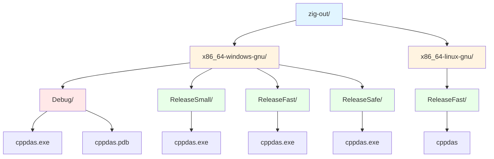

<p style="margin: 0; padding: 0;">
  
</p>

# Compilation Guide

This guide covers building the boostdas project using the Zig build system.

## Prerequisites

- Zig 0.15.2 installed (see [INSTALLATION.md](INSTALLATION.md))
- Internet connection (for first build to fetch dependencies)
- Windows 10/11 with PowerShell

## First-Time Setup

### 1. Create Required Directories

On first build, you may encounter a temporary directory error. Create it manually:

```powershell
New-Item -ItemType Directory -Path "$env:LOCALAPPDATA\zig\tmp" -Force
```

### 2. Fetch Dependencies

The build system will automatically download Boost libraries on first build. Optionally, you can fetch dependencies explicitly:

```powershell
zig build --fetch
```

## Basic Build Commands

### Default Debug Build

```powershell
zig build
```

**Output Location**: `zig-out\x86_64-windows-gnu\Debug\cppdas.exe`  
**Size**: ~5.5 MB (Debug build includes symbols)

### Build and Run

```powershell
zig build run
```

This builds the project and immediately runs the executable.

### List Available Build Steps

```powershell
zig build --list-steps
```

Available steps:
- `install` (default) - Build and copy artifacts
- `run` - Build and run the application
- `docs` - Build Doxygen documentation
- `uninstall` - Remove build artifacts

## Optimization Levels

Use `-Doptimize` to control optimization:

### ReleaseSmall (Smallest Binary)

```powershell
zig build -Doptimize=ReleaseSmall
```

**Output**: `zig-out\x86_64-windows-gnu\ReleaseSmall\cppdas.exe`  
**Size**: ~740 KB

### ReleaseFast (Maximum Performance)

```powershell
zig build -Doptimize=ReleaseFast
```

### ReleaseSafe (Optimized with Safety Checks)

```powershell
zig build -Doptimize=ReleaseSafe
```

### Debug (Default, with Symbols)

```powershell
zig build -Doptimize=Debug
```

## Compile-Time Feature Flags

The project supports conditional compilation to exclude functionality:

### Disable Logging

Removes all logging code at compile-time:

```powershell
zig build -Dnologs
```

**Benefits**: Smaller binary, better performance


### Generate Compilation Database

For IDE integration (code completion, navigation):

```powershell
zig build -Dcompiledb
```

This creates `compile_commands.json` in the project root.

## Combined Build Examples

### Development Build with Compilation Database

```powershell
zig build -Dcompiledb=true
```

## Cross-Compilation

### Linux (Dynamic Linking)

```powershell
zig build -Dtarget=x86_64-linux-gnu -Doptimize=ReleaseFast
```

**Output**: `zig-out\x86_64-linux-gnu\ReleaseFast\cppdas`

### Linux (Static Linking with musl)

```powershell
zig build -Dtarget=x86_64-linux-musl -Doptimize=ReleaseSmall
```

This creates a completely standalone binary with no external dependencies.

## Build Output Structure

Build artifacts are organized by architecture, OS, ABI, and optimization level:



## Running the Application

### Run with Default Arguments

```powershell
.\zig-out\x86_64-windows-gnu\Debug\cppdas.exe
```

### Run with Custom Log Paths

```powershell
zig build run -- -dasLog myDas.log -rebinLog myRebin.log
```

**Note**: The `--` separates build arguments from runtime arguments.

### Show Runtime Help

```powershell
zig build run -- -h
```

Or directly:

```powershell
.\zig-out\x86_64-windows-gnu\Debug\cppdas.exe -h
```

**Output**:
```
Usage: cppdas [-dasLog [file_name]] [-rebinLog [file_name]]
```

## Cleaning Build Artifacts

### Remove Build Outputs

```powershell
Remove-Item -Recurse -Force zig-out
```

### Remove Cache (Forces Complete Rebuild)

```powershell
Remove-Item -Recurse -Force zig-cache
Remove-Item -Recurse -Force .zig-cache
```

### Clean All Build Artifacts

```powershell
Remove-Item -Recurse -Force zig-out, zig-cache, .zig-cache
```

## Advanced Build Options

### Verbose Build Output

See all commands being executed:

```powershell
zig build --verbose
```

### Parallel Build Jobs

Control CPU usage (default uses all cores):

```powershell
zig build -j4
```

### Build Summary

Control what's printed:

```powershell
zig build --summary all      # Show everything
zig build --summary failures # Show only failures (default)
zig build --summary none     # No summary
```

## Troubleshooting

### Issue: "unable to walk temporary directory"

**Cause**: Zig temp directory doesn't exist.

**Solution**:
```powershell
New-Item -ItemType Directory -Path "$env:LOCALAPPDATA\zig\tmp" -Force
```

### Issue: Build fails with Boost errors on first build

**Cause**: Network issues downloading dependencies.

**Solution**:
- Check Internet connection
- Try explicit fetch: `zig build --fetch`
- Check firewall settings

### Issue: "FileNotFound" errors during build

**Cause**: Incomplete dependency fetch.

**Solution**:
```powershell
# Clean and rebuild
Remove-Item -Recurse -Force .zig-cache, zig-cache
zig build --fetch
zig build
```

### Issue: Binary size larger than expected

**Cause**: Debug build or features not disabled.

**Solution**:
```powershell
# Build smallest possible binary
zig build -Doptimize=ReleaseSmall -Dnologs=true
```

### Issue: Linker errors on Windows

**Cause**: Missing system libraries.

**Solution**: The build automatically links `Ws2_32` on Windows. If errors persist:
- Ensure you're using the correct target for your system
- Try rebuilding from clean state

## Build Performance Tips

1. **Use incremental builds**: Zig caches build artifacts automatically
2. **First build is slow**: Dependencies are downloaded and compiled
3. **Subsequent builds are fast**: Only changed files are recompiled
4. **Parallel compilation**: Zig uses all CPU cores by default
5. **Cross-compilation is fast**: No additional toolchains needed

## IDE Integration

### Generate compile_commands.json

```powershell
zig build -Dcompiledb=true
```

This enables:
- Code completion in VS Code (with C/C++ extension)
- Jump to definition
- Error checking in IDE
- Symbol navigation

### Recommended VS Code Extensions

- C/C++ (Microsoft)
- clangd (alternative to C/C++)
- Zig Language (for build.zig syntax highlighting)

## Binary Size Comparison

| Configuration | Size | Notes |
|--------------|------|-------|
| Debug (default) | ~5.5 MB | Includes debug symbols (.pdb) |
| ReleaseSmall | ~740 KB | Optimized for size |
| ReleaseSmall + -Dnologs | ~700 KB | Further optimized |
| ReleaseFast | ~800 KB | Optimized for speed |

## Next Steps

- See [README.md](README.md) for application usage
- See [INSTALLATION.md](INSTALLATION.md) for Zig installation
- Run `zig build -h` for all build options
- Run `zig build run -- -h` for runtime options

---

**Last Updated**: February 4, 2026  
**Zig Version**: 0.15.2  
**Tested On**: Windows 11 x64
