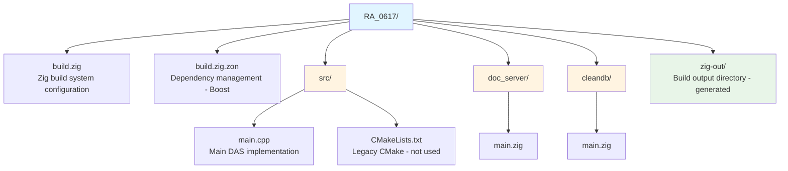

# RA_0617 - BoostDAS Source Code

## Overview

This directory contains the complete source code for the BoostDAS project - a high-performance Data Analytics Solution (DAS) implementation in C++23 using the Boost libraries.

## Project Structure



## Technology Stack

- **Language**: C++23
- **Libraries**: 
  - Boost.Beast (HTTP server)
  - Boost.ASIO (Async I/O)
  - Boost.JSON (JSON parsing)
- **Build System**: Zig 0.15.2
- **Target Platforms**: Windows, Linux (x86_64)

## Key Features

### High Performance
- Native C++ implementation
- Optimized builds as small as 600KB
- No runtime dependencies (musl builds)
- Compile-time feature toggling

### Cross-Platform
- Build for Windows and Linux from any machine
- Static linking support for standalone deployment
- Target ARM architectures (experimental)

### Flexible Configuration
- Compile-time flags (`-Dnologs`)
- Runtime configuration (URL, log path)
- Multiple optimization levels

## Building the Project

### Prerequisites
- Zig 0.15.2 installed
- Internet connection (first build only, for dependencies)

### Basic Build
```sh
zig build
```

### Optimized Release Build
```sh
zig build -Doptimize=ReleaseSmall
```

### Cross-Compile for Linux
```sh
zig build -Dtarget=x86_64-linux-musl -Doptimize=ReleaseSmall
```

### Build Options

**Optimization Levels:**
- `Debug` (default) - ~5.5 MB with symbols
- `ReleaseSmall` - ~740 KB, optimized for size
- `ReleaseFast` - Optimized for speed
- `ReleaseSafe` - Optimized with safety checks

**Feature Flags:**
- `-Dnologs` - Disable all logging (smaller binary, better performance)

**Target Platforms:**
- `x86_64-windows-gnu` (default on Windows)
- `x86_64-linux-gnu` (dynamic linking)
- `x86_64-linux-musl` (static linking, standalone)

## Running the DAS

### Default Configuration
```sh
zig build run
```
- URL: `http://localhost:4242/cppdas/`
- Log: `DasLog.log`

### Custom Configuration
```sh
zig build run -- -dasUrl "http://localhost:8080/mydas/" -dasLog custom.log
```

### Direct Execution
```sh
./zig-out/x86_64-windows-gnu/Debug/cppdas.exe
```

## Runtime Options

- `-h` or `--help` - Display help
- `-dasUrl [url]` - Set DAS URL with port and path
- `-dasLog [file]` - Set log file path

**To stop the DAS**: Type 'Q' in the terminal

## Documentation

Build and serve the documentation:
```sh
zig build docs
```

## Files Included

- **build.zig** - Complete build configuration with cross-compilation
- **build.zig.zon** - Boost dependency specifications
- **src/main.cpp** - DAS implementation with Boost.Beast HTTP server
- **Dockerfile** - Container deployment configuration
- **docker-compose.yml** - Multi-container orchestration
- **Doxyfile** - API documentation generator config
- **.gitignore** - Version control exclusions

## Documentation Files

- **INSTALLATION.md** - Step-by-step setup guide
- **COMPILATION.md** - Comprehensive build instructions
- **IMPLEMENTATION_GUIDE.md** - Developer customization guide
- **DOCKER.md** - Container deployment guide
- **ZIG_OVERVIEW.md** - Introduction to Zig build system

## Development Workflow

1. **First Time Setup**
   ```sh
   # Create temporary directory (Windows)
   New-Item -ItemType Directory -Path "$env:LOCALAPPDATA\zig\tmp" -Force
   
   # Fetch dependencies
   zig build --fetch
   ```

2. **Development**
   ```sh
   # Build and test
   zig build run
   
   # Make changes to src/main.cpp
   # Rebuild automatically
   zig build run
   ```

3. **Release**
   ```sh
   # Create optimized Windows build
   zig build -Doptimize=ReleaseSmall
   
   # Create Linux deployment
   zig build -Dtarget=x86_64-linux-musl -Doptimize=ReleaseSmall -Dnologs
   ```

## Deployment

### Windows
- Copy executable from `zig-out/x86_64-windows-gnu/ReleaseSmall/cppdas.exe`
- No dependencies required
- Run with desired command-line arguments

### Linux (UltraEdge)
- Build with `-Dtarget=x86_64-linux-musl`
- Transfer executable to target machine
- Set executable permissions: `chmod +x cppdas`
- Run with configuration options

### Docker
```sh
docker-compose up -d
```

## Performance Benchmarks

| Configuration | Binary Size | Notes |
|---------------|-------------|-------|
| Debug | ~5.5 MB | Full symbols for debugging |
| ReleaseSmall | ~740 KB | Size optimized |
| ReleaseSmall -Dnologs | ~600 KB | Minimal footprint |
| ReleaseFast | ~1.2 MB | Speed optimized |

## Support and Contributions

For questions or issues:
1. Check documentation files (INSTALLATION.md, COMPILATION.md)
2. Review build output with `zig build -h`
3. Examine build configuration in build.zig

## License

Part of the Teradyne Archimedes Reference Architecture series.

---

**Version**: 1.0  
**Last Updated**: February 2026  
**Zig Version**: 0.15.2  
**C++ Standard**: C++23  
**Boost Version**: Latest (auto-fetched by Zig)
